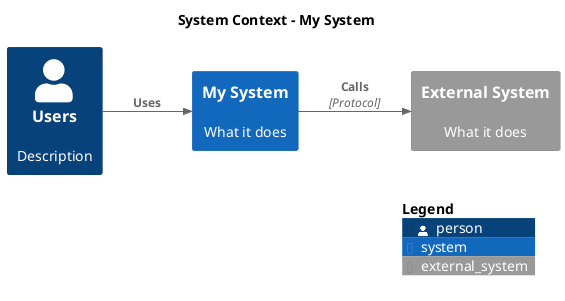
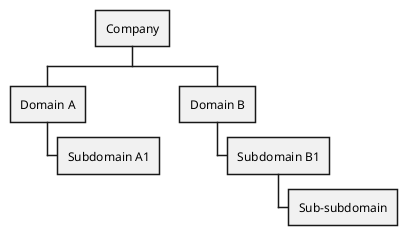

# Diagram Generation

Generate professional diagrams by routing each request to the best-fit
tool. For UML, C4, and DDD diagram types, use **PlantUML** (text-based,
standard notation). For everything else, use Python libraries via `uv`
inline scripts.

## Interaction Protocol

1. **Classify** the diagram type. If ambiguous, ask:
   > What kind of diagram?
   > - C4 (Context / Container / Component)
   > - UML Use Case
   > - UML Activity / BPMN-style workflow
   > - UML State Machine
   > - DDD Context Map
   > - Subdomain Decomposition (WBS)
   > - ERD (Conceptual or Logical)
   > - Flowchart / pipeline
   > - Architecture (generic boxes + arrows)
   > - Cloud/infra architecture (AWS, GCP, K8s icons)
   > - Pyramid / stacked layers
   > - Sequence diagram
   > - Network / DAG
   > - Block diagram
   > - Excalidraw (editable, hand-drawn sketch style)

2. **Pick the tool** from the routing table. For PlantUML types,
   do NOT offer Python alternatives — PlantUML is the only correct
   choice for standard notation. Skip to step 3.

3. **Ask output path**: "Where should I save the diagram?"
   Default to current directory if the user doesn't specify.

4. **Check prerequisites** based on the tool:

   For **PlantUML**:
   ```bash
   plantuml -version 2>/dev/null || docker image inspect plantuml/plantuml-cli:plantuml-cli-v1.0.1 >/dev/null 2>&1
   ```
   If neither is available, show:
   - macOS: `brew install plantuml`
   - Docker: `docker pull plantuml/plantuml-cli:plantuml-cli-v1.0.1`
   - **Do NOT fall back to a Python approximation.** Stop and ask the
     user to install one of the above.

   For **Graphviz-dependent** Python libraries:
   ```bash
   dot -V
   ```

5. **Generate** the diagram:
   - PlantUML: write a `.puml` file, render with `plantuml -tsvg`
     or Docker. Open the SVG.
   - Python: write a `uv run`-compatible inline script. Run it. Open
     the SVG.

6. **Iterate** on user feedback.

## Routing Table

### PlantUML (standard notation — no alternatives)

| Diagram type                    | Template                           |
|---------------------------------|------------------------------------|
| C4 Context Diagram              | `templates/c4-context.puml`        |
| C4 Container Diagram            | `templates/c4-container.puml`      |
| UML Use Case                    | `templates/use-case.puml`          |
| UML Use Case (detailed)         | `templates/use-case-detailed.puml` |
| UML Activity Diagram            | `templates/activity-diagram.puml`  |
| UML Activity (with decisions)   | `templates/activity-diagram-decision.puml` |
| UML State Machine               | `templates/state-machine.puml`     |
| DDD Context Map                 | `templates/context-map.puml`       |
| Subdomain Decomposition (WBS)   | `templates/subdomain-decomposition.puml` |
| Conceptual ERD                  | `templates/conceptual-erd.puml`    |
| Logical ERD                     | `templates/logical-erd.puml`       |
| Logical ERD (changelog pattern) | `templates/logical-erd-changelog.puml` |
| Logical ERD (users/roles)       | `templates/logical-erd-users.puml` |

### Python libraries (custom diagrams)

| Diagram type             | Primary                   | Alternative(s)              | When to pick alternative                          |
|--------------------------|---------------------------|-----------------------------|---------------------------------------------------|
| Flowchart / pipeline     | graphviz                  | schemdraw                   | No Graphviz installed; simple linear flow          |
| Generic architecture     | graphviz                  | grandalf + drawsvg          | No Graphviz installed; pure Python                 |
| Cloud/infra architecture | diagrams (mingrammer)     | graphviz                    | Don't need cloud provider icons                    |
| Pyramid / stacked layers | svgwrite                  | drawsvg                     | Prefer cleaner API, less precise control needed    |
| Sequence diagram         | seqdiag                   | svgwrite                    | seqdiag for speed; svgwrite for full control       |
| FSM / state machine (custom) | graphviz              | PlantUML (preferred for UML) | Use graphviz when PlantUML unavailable or when embedding in notebooks via SVG pipe |
| Memory layout / byte-level  | matplotlib             | svgwrite                    | matplotlib for annotated 2D layouts with arrows; svgwrite for static SVGs          |
| Network / graph (cyclic) | networkx + matplotlib     | grandalf + drawsvg          | Pure Python auto-layout without matplotlib         |
| DAG (acyclic pipeline)   | svgwrite                  | graphviz                    | graphviz for auto-layout; svgwrite for precision   |
| Block diagram            | grandalf + drawsvg        | blockdiag, schemdraw, draw.io | blockdiag for DSL; schemdraw for flow; draw.io for editable |
| Subdomain → BC mapping   | drawsvg                   | --                            | `scripts/subdomain-bc-mapping.py` — bipartite layout        |
| Any (editable, sketch)   | Excalidraw (excalidraw skill) | --                        | Editable `.excalidraw` JSON with hand-drawn aesthetic       |
| Any (editable, precise)  | draw.io (drawio skill)    | --                            | Editable diagram they can modify in Draw.io                 |

## Bounded Context Naming Rules

When helping engineers name bounded contexts, apply these rules:

**The litmus test:** Does this name answer "what does this system do?"
without needing elaboration?

### Four naming smells

1. **Too concrete / physical** — names a place or thing, not a capability.
   `Warehouse` → what *about* the warehouse? → `Warehouse Management`

2. **Redundant verb** — adds an activity word to a name that already
   implies activity. `Pricing Computing` → `Pricing` already means
   computing prices. `Shipping Shipping` → just `Shipping`.

3. **Too abstract / generic** — so vague it could mean anything.
   `Core Service`, `Platform`, `Engine` → name the actual capability.

4. **Entity-named** — named after a data entity, not a behavior.
   `Orders`, `Products`, `Users` → what does the system *do* with them?

### The rule

> A bounded context name should be a **noun or noun phrase that
> inherently implies a capability**. If the noun alone doesn't convey
> what the system does, add a gerund/activity word. If it already does,
> don't.

### Examples

| Subdomain             | BC name          | Why it works                                      |
|-----------------------|------------------|---------------------------------------------------|
| Order Fulfillment     | Order Fulfillment | "Fulfillment" already implies the activity        |
| Product Catalog       | Product Catalog   | Clear what it does — catalogs products            |
| Pricing & Promotions  | Pricing           | "Pricing" already means computing prices          |
| Pricing & Promotions  | Promotion Management | "Promotions" alone is entity-named; needs verb |
| Inventory Management  | Warehouse Management | "Warehouse" alone is a place; needs verb       |
| Payment Processing    | Payment Processing | Activity-oriented, self-explanatory              |

### 1:1 mapping rule

If a bounded context maps 1:1 to a subdomain, **keep the same name**.
Only rename when the BC represents a genuinely different decomposition
from the subdomain.

## PlantUML Reference

### Execution

Always try local binary first, then Docker. Never silently degrade.

```bash
# Local (preferred)
plantuml -tsvg diagram.puml

# Docker (fallback)
docker run --rm -v "$(pwd):/data" plantuml/plantuml-cli:plantuml-cli-v1.0.1 -tsvg /data/diagram.puml
```

### Standard Skinparam Block

Apply this to ALL PlantUML diagrams (except C4, which has its own styling):

```plantuml
skinparam backgroundColor transparent
skinparam {componentType} {
  BackgroundColor #ffffff
  BorderColor #1a5ad7
  FontColor #0b2147
  FontSize 14
}
skinparam arrow {
  Color #24428b
}
```

Replace `{componentType}` with the relevant type: `class`, `state`,
`activity`, `rectangle`, `usecase`, `node`, etc.

### C4 Diagrams

Use the PlantUML C4 standard library:



### DDD Context Map

Use rectangles with upstream/downstream annotations:

```plantuml
rectangle "My Context" as MC #lightblue
rectangle "External Context" as EC

MC -down-> EC : **[U]** My Context\n**[D]** External Context\nPublished Language
```

Integration patterns to annotate: Published Language, Partnership,
Customer-Supplier, Anti-Corruption Layer (ACL), Conformist, Open Host.

### Subdomain Decomposition (WBS)

Use `@startwbs` with `<<inScope>>` to highlight the bounded context:



### PlantUML Layout Tips

1. **Hidden links for layout control** — force vertical arrangement:
   ```plantuml
   A -[hidden]down- B
   B -[hidden]down- C
   ```

2. **Complete chains** — every element must be in the hidden chain
   or layout breaks.

3. **Direction commands** — `left to right direction` or
   `top to bottom direction` set the overall flow.

4. **`skinparam ranksep 150`** — increase spacing between ranks
   for readability in use case diagrams.

### PlantUML Sequence Diagram Tips

1. **`ArrowFontSize` controls message labels**, not `MessageFontSize`.
   The correct skinparam for sequence diagram arrow label font size:
   ```plantuml
   skinparam sequence {
     ArrowFontSize 8
   }
   ```

2. **`ParticipantPadding` controls horizontal spacing** between
   participant lifelines. Increase to 40+ when long message labels
   overlap adjacent lifeline bars.

3. **Self-arrows (`A -> A`) extend below the activation bar** if the
   bar doesn't have enough messages after the self-arrow. PlantUML
   sizes activation bars based on messages within them. To extend a
   bar past a self-arrow, add a message (labeled or unlabeled) from
   the participant to another participant AFTER the self-arrow:
   ```plantuml
   activate WF
   WF -> WF : await Signal
   note right of WF
     SUSPENDED
   end note
   WF --> TS : yield
   deactivate WF
   ```

4. **The `...` delay syntax breaks ALL activation bars.** It creates
   a gap in every active lifeline. If you need some bars to remain
   continuous through a time gap, use `||N||` spacers with a note
   instead:
   ```plantuml
   ||10||
   note right of TS #white;line:white
     <size:9><color:#888888>time passes</color></size>
   end note
   ||5||
   ```
   The `#white;line:white` makes the note box invisible — just
   floating text.

5. **Notes inherit skinparam styling.** To make a note appear as
   plain floating text (no box), override both background and border
   per-note with `#white;line:white`. The `#background;line:border`
   syntax only works in multi-line note blocks, not inline `:` notes.

## Embedding Diagrams in Notebooks (marimo, Jupyter)

When generating diagrams inside interactive notebooks rather than as
standalone scripts, prefer **pre-rendering to a file and embedding the
image** over generating dynamically in a cell. Dynamic generation makes
iteration painful — you can't see intermediate results, errors are
opaque, and layout tuning requires full re-execution.

If you must generate inline:

1. **graphviz SVG pipe** is the most reliable approach for node+edge
   diagrams. Render to SVG string and embed in the notebook's HTML
   output:
   ```python
   import graphviz
   g = graphviz.Digraph(format="svg")
   g.attr(bgcolor="white", rankdir="TB", fontname="Helvetica")
   # ... build graph ...
   svg = g.pipe(format="svg").decode("utf-8")
   # In marimo: mo.md(f"...{svg}...")
   # In Jupyter: from IPython.display import SVG, display; display(SVG(svg))
   ```

2. **matplotlib for memory layouts and coordinate-precise diagrams.**
   Use matplotlib when you need exact control over rectangle positions,
   byte-level addresses, and pointer arrows — things auto-layout tools
   can't express.

3. **Do NOT use matplotlib for state machines, flowcharts, or anything
   with nodes + edges.** Manual circle/arrow positioning in matplotlib
   is fragile — zorder bugs, arrow routing conflicts, and text
   centering all require tedious manual tuning. Use graphviz or
   PlantUML instead, which handle layout automatically.

## Python Library Quick Reference

### graphviz (pip: graphviz) -- REQUIRES SYSTEM BINARY

Thin Python wrapper around Graphviz DOT. Best for anything with
nodes + edges + auto-layout.

- `graphviz.Digraph` (directed) / `graphviz.Graph` (undirected)
- Engines: `dot` (hierarchical), `neato` (force-directed), `circo` (circular)
- Clusters via `with dot.subgraph(name="cluster_xxx"):`
- Record nodes for ERDs: `shape="record"`, `<port> field` syntax
- Output: `dot.render(filename, directory, cleanup=True)` or `dot.pipe(encoding="utf-8")`
- Example: `scripts/flowchart-graphviz.py`

#### Graphviz Label & Layout Tips

1. **Edge labels overlap arrows by default.** Pad labels with spaces to
   shift them away from the arrow line:
   ```python
   dot.edge("a", "b", label="   HTTP   ")  # spaces push label right
   ```
   Graphviz centers labels on the edge midpoint. Leading/trailing spaces
   shift the rendered text without affecting layout computation.

2. **Cluster labels overlap node content when the cluster is narrow.**
   Fix by padding the cluster label or setting a minimum margin:
   ```python
   c.attr(label="  Behavior  ", margin="20")
   ```
   This forces the cluster to be wider, giving the label room.

3. **Use `compound=true` + `lhead`/`ltail` to point arrows at cluster
   borders** instead of individual nodes inside them:
   ```python
   dot.attr(compound="true")
   dot.edge("client", "api", lhead="cluster_backend")  # arrow stops at cluster border
   ```

4. **Force cluster ordering** with invisible edges between nodes in
   different clusters:
   ```python
   dot.edge("node_in_cluster_a", "node_in_cluster_c", style="invis")
   ```

5. **Avoid long multi-line labels** on edges — they create large bounding
   boxes that distort layout. Keep edge labels to 1-2 short lines max.
   Move detailed descriptions into node labels or annotations instead.

### diagrams (pip: diagrams) -- REQUIRES SYSTEM BINARY

Cloud/infra architecture with provider icon sets (AWS, GCP, K8s, Azure).
41k GitHub stars.

- `with Diagram(name, outformat="svg", show=False):`
- `with Cluster("name"):` for grouping
- Operators: `>>` (connect), `-` (undirected)
- Supports SVG, PNG, PDF, JPG output
- Example: `scripts/cloud-arch-diagrams.py`

### svgwrite (pip: svgwrite)

Low-level SVG generation with full coordinate control. Best for custom
geometry (pyramids, stacked layers, custom illustrations).

- `svgwrite.Drawing(path, size, viewBox)`
- All geometry must be computed -- never hardcode coordinates
- Configuration constants at the top of the script
- Per-element nudges via `y_nudge`/`x_nudge` fields
- Example: `scripts/pyramid-svgwrite.py`

### drawsvg (pip: drawsvg~=2.0)

Nicer API than svgwrite for freeform SVG. Snake_case kwargs auto-convert
to SVG attributes (`fill_opacity` -> `fill-opacity`).

- `draw.Drawing(width, height)`
- `draw.Path()` with `.M()`, `.L()`, `.Z()` methods
- `d.save_svg("file.svg")`
- Note: v2 has y-axis pointing down (SVG convention)
- Example: `scripts/pyramid-drawsvg.py`

### schemdraw (pip: schemdraw)

Pure Python flowcharts via `schemdraw.flow` module. No system deps.

- Elements: `Start`, `Box`, `RoundBox`, `Decision`, `Data`, `Arrow`
- Positioning: `.drop("S")`, `.at(element.S).down()`
- Decision branches: `Decision(W="No", S="Yes")`
- Avoid `&`, `<`, `>` in labels (no XML escaping)
- Example: `scripts/flowchart-schemdraw.py`

### seqdiag (pip: seqdiag, setuptools<70, Pillow<10)

Sequence diagrams from text DSL. Auto-layout.

**WARNING**: Unmaintained since 2021. Requires pinned old dependencies.

- DSL: `actor -> actor [label = "msg"];` / `<--` for dashed returns
- Separators: `=== label ===`
- Parse + build + draw pattern
- Example: `scripts/sequence-seqdiag.py`

### blockdiag (pip: blockdiag, setuptools<70, Pillow<10)

Block/grid diagrams from text DSL. Auto-layout.

**WARNING**: Unmaintained since 2021. Same dependency constraints as seqdiag.

- DSL: `A -> B -> C;` with `group { }` for visual grouping
- Shapes: box, roundedbox, diamond, ellipse, note, cloud
- Example: `scripts/block-blockdiag.py`

### networkx + matplotlib (pip: networkx, matplotlib)

Graph-theory layouts. Best for DAGs with `topological_generations` +
`multipartite_layout`.

- `nx.DiGraph(edge_list)` -> compute layers -> `multipartite_layout`
- `nx.draw_networkx_nodes/edges/labels(G, pos, ax=ax)`
- `fig.savefig("file.svg", format="svg", bbox_inches="tight")`
- Use `matplotlib.use("Agg")` before importing pyplot in scripts
- Example: `scripts/network-networkx.py`

#### matplotlib Pitfalls (applies to any matplotlib diagram)

1. **zorder: patches paint over text.** `plt.Circle`, `FancyBboxPatch`,
   and other patches default to zorder ~1-2, but text defaults to ~3.
   If you set a patch to a high zorder (e.g., `zorder=5`), it will
   cover text at the default zorder. **Always set text zorder higher
   than any overlapping patch.** For example, if circles are at
   `zorder=5`, set labels inside them to `zorder=10`.
   ```python
   ax.add_patch(plt.Circle((x, y), r, zorder=5, ...))
   ax.text(x, y, "State0", zorder=10, ha="center", va="center")
   ```

2. **FancyArrowPatch arc direction.** `connectionstyle="arc3,rad=X"`:
   positive `rad` curves left/above (relative to source→target
   direction), negative curves right/below. Use negative rad to route
   arrows below content they would otherwise cover. For example, an
   arrow that would cross a label can be routed around it:
   ```python
   arrow = FancyArrowPatch(posA, posB,
       connectionstyle="arc3,rad=-0.35",  # curves below
       ...)
   ```

3. **Don't use matplotlib for node+edge diagrams.** State machines,
   flowcharts, and architecture diagrams require manual positioning
   of every circle, box, and arrow. Each layout change cascades into
   coordinate recalculations. Use graphviz or PlantUML instead — they
   handle layout automatically and produce cleaner results with less
   code.

### erdantic (pip: erdantic) -- REQUIRES SYSTEM BINARY (graphviz)

ERD generation from Pydantic/dataclass/attrs models. Auto-discovers
relationships from type annotations.

- `erd.to_dot(Model)` returns DOT source (post-processable)
- `erd.draw(Model, out="file.svg")` for direct rendering
- Color entity headers via DOT post-processing: inject `bgcolor` on
  header `<td>` elements using regex on node definition lines
- On macOS with homebrew graphviz, may need:
  `CFLAGS="-I/opt/homebrew/opt/graphviz/include" LDFLAGS="-L/opt/homebrew/opt/graphviz/lib"`
- Example: `scripts/erd-erdantic.py`

### grandalf + drawsvg (pip: grandalf, drawsvg~=2.0)

Pure Python graph layout (Sugiyama algorithm) + SVG rendering. No system
dependencies. Best for block diagrams and network graphs when Graphviz
is not available.

- `grandalf.layouts.SugiyamaLayout` for hierarchical layout
- Combine with drawsvg for SVG output
- Supports cycles (unlike pure svgwrite manual layout)
- Example: `scripts/network-grandalf.py`, `scripts/block-grandalf.py`

### Draw.io (native XML) -- separate skill

For Draw.io diagrams, prefer the **`drawio` skill** which generates
native mxGraphModel XML directly (no Python dependency). It supports
CLI export to PNG/SVG/PDF with embedded XML so the output stays
editable. See `skills/drawio/SKILL.md`.

The `drawpyo` Python library (`scripts/block-drawpyo.py`) is an
alternative when you need programmatic generation in a `uv run` script.

## Script Template (Python libraries only)

All Python scripts use `uv` inline metadata:

```python
# /// script
# requires-python = ">=3.10"
# dependencies = ["library-name"]
# ///
"""Description of what this diagram shows."""
from pathlib import Path
# ... imports ...

def main() -> None:
    Path("output").mkdir(exist_ok=True)
    # ... build diagram ...
    # ... save to output/ ...
    print(f"Saved: output/filename.svg")

if __name__ == "__main__":
    main()
```

## Style Defaults

Unless the user specifies otherwise:

- **Font**: Helvetica, Arial, sans-serif
- **Stroke**: #333-#555, 1.2-2px
- **Fills**: muted material-design tones (not neon, not pastel candy)
- **Text**: black/#333 for labels, #666 for annotations
- **No gradients, no decorative elements**
- **PlantUML theme**: transparent background, `#1a5ad7` borders, `#0b2147` text

## svgwrite Patterns (Custom Geometry)

For diagrams that need precise coordinate control (pyramids, custom shapes):

1. **Never write raw SVG by hand.** Always generate from a Python script.
2. **All geometry must be computed.** Write functions for intersections.
3. **Configuration at the top.** Dimensions, padding, colors, fonts, labels
   in module-level constants.
4. **Per-element nudges OK.** Add `y_nudge`/`x_nudge` to config when needed.
5. **Keep the script in the repo** next to the output SVG.
6. **Iterate visually.** Open the SVG, ask for feedback, adjust constants.
7. **Edge labels must not overlap arrows.** When placing text near an
   arrow, offset the label by at least 8-12px perpendicular to the arrow
   direction. For horizontal arrows, place labels above (`my - 10`).
   For vertical arrows, place labels to the right (`mx + 10`). Never
   place a label at the exact midpoint of an arrow without an offset.
8. **Container labels need breathing room.** When a cluster/group label
   is short (e.g., "State"), pad the container with extra margin so the
   label doesn't visually collide with the child nodes inside it.
9. **Arrows to curved shapes need per-edge nudging.** When arrows target
   elliptical shapes (cylinders, ellipses), the visual border varies by
   where the arrow hits. Arrows hitting the side of an ellipse need more
   inward nudge than arrows hitting the center. Compute separate
   `target_top`/`target_bot` values and add 5-8px nudge toward the shape
   center. Always render and visually verify — math alone won't match
   perception.
10. **Labels on vertical arrows go to the side, not centered.** A label
    centered on a vertical arrow's midpoint sits directly on the line.
    Use `label_dx=±40` to push it left or right. For diagonal arrows,
    offset labels perpendicular to the line with both `label_dx` and
    `label_dy` — typically 15-20px in each direction.
11. **svgwrite `style=""` (empty string) is invalid.** When building
    optional style attributes (e.g., dashed lines), use a dict and only
    add the `style` key when the value is non-empty:
    ```python
    extra = {"style": "stroke-dasharray:4,3"} if dashed else {}
    dwg.add(dwg.line(..., **extra))
    ```
12. **Cylinder shapes need generous height.** A cylinder's top ellipse
    overlaps the label text if `ry` is too small or the body too short.
    Use `ry >= 10` and `h >= 70` for readable cylinders. Place the label
    text below center (`cy + 2`) to clear the top ellipse lid.
13. **Symmetry through equal spacing.** In multi-row layouts, ensure the
    vertical gap between the center element and the rows above/below it
    is roughly equal. Visually verify and adjust — the bottom row often
    needs to be pushed 10-20px further down than the math suggests.
