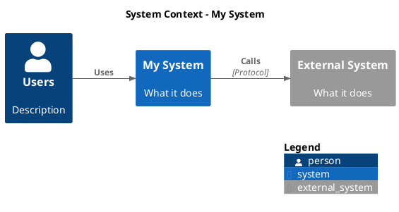
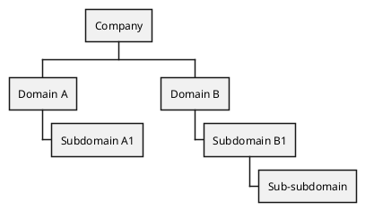

# PlantUML Reference

## Execution

Always try local binary first, then Docker. Never silently degrade.

```bash
# Local (preferred)
plantuml -tsvg diagram.puml

# Docker (fallback)
docker run --rm -v "$(pwd):/data" plantuml/plantuml-cli:plantuml-cli-v1.0.1 -tsvg /data/diagram.puml
```

## Standard Skinparam Block

Apply this to ALL PlantUML diagrams (except C4, which has its own styling):

```plantuml
skinparam backgroundColor transparent
skinparam {componentType} {
  BackgroundColor #ffffff
  BorderColor #1a5ad7
  FontColor #0b2147
  FontSize 14
}
skinparam arrow {
  Color #24428b
}
```

Replace `{componentType}` with the relevant type: `class`, `state`,
`activity`, `rectangle`, `usecase`, `node`, etc.

## C4 Diagrams

Use the PlantUML C4 standard library:



## DDD Context Map

Use rectangles with upstream/downstream annotations:

```plantuml
rectangle "My Context" as MC #lightblue
rectangle "External Context" as EC

MC -down-> EC : **[U]** My Context\n**[D]** External Context\nPublished Language
```

Integration patterns to annotate: Published Language, Partnership,
Customer-Supplier, Anti-Corruption Layer (ACL), Conformist, Open Host.

## Subdomain Decomposition (WBS)

Use `@startwbs` with `<<inScope>>` to highlight the bounded context:



## Layout Tips

1. **Hidden links for layout control** — force vertical arrangement:
   ```plantuml
   A -[hidden]down- B
   B -[hidden]down- C
   ```

2. **Complete chains** — every element must be in the hidden chain
   or layout breaks.

3. **Direction commands** — `left to right direction` or
   `top to bottom direction` set the overall flow.

4. **`skinparam ranksep 150`** — increase spacing between ranks
   for readability in use case diagrams.

## Sequence Diagram Tips

1. **`ArrowFontSize` controls message labels**, not `MessageFontSize`.
   The correct skinparam for sequence diagram arrow label font size:
   ```plantuml
   skinparam sequence {
     ArrowFontSize 8
   }
   ```

2. **`ParticipantPadding` controls horizontal spacing** between
   participant lifelines. Increase to 40+ when long message labels
   overlap adjacent lifeline bars.

3. **Self-arrows (`A -> A`) extend below the activation bar** if the
   bar doesn't have enough messages after the self-arrow. PlantUML
   sizes activation bars based on messages within them. To extend a
   bar past a self-arrow, add a message (labeled or unlabeled) from
   the participant to another participant AFTER the self-arrow:
   ```plantuml
   activate WF
   WF -> WF : await Signal
   note right of WF
     SUSPENDED
   end note
   WF --> TS : yield
   deactivate WF
   ```

4. **The `...` delay syntax breaks ALL activation bars.** It creates
   a gap in every active lifeline. If you need some bars to remain
   continuous through a time gap, use `||N||` spacers with a note
   instead:
   ```plantuml
   ||10||
   note right of TS #white;line:white
     <size:9><color:#888888>time passes</color></size>
   end note
   ||5||
   ```
   The `#white;line:white` makes the note box invisible — just
   floating text.

5. **Notes inherit skinparam styling.** To make a note appear as
   plain floating text (no box), override both background and border
   per-note with `#white;line:white`. The `#background;line:border`
   syntax only works in multi-line note blocks, not inline `:` notes.
